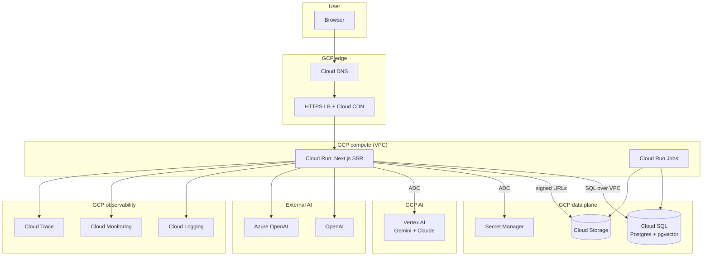
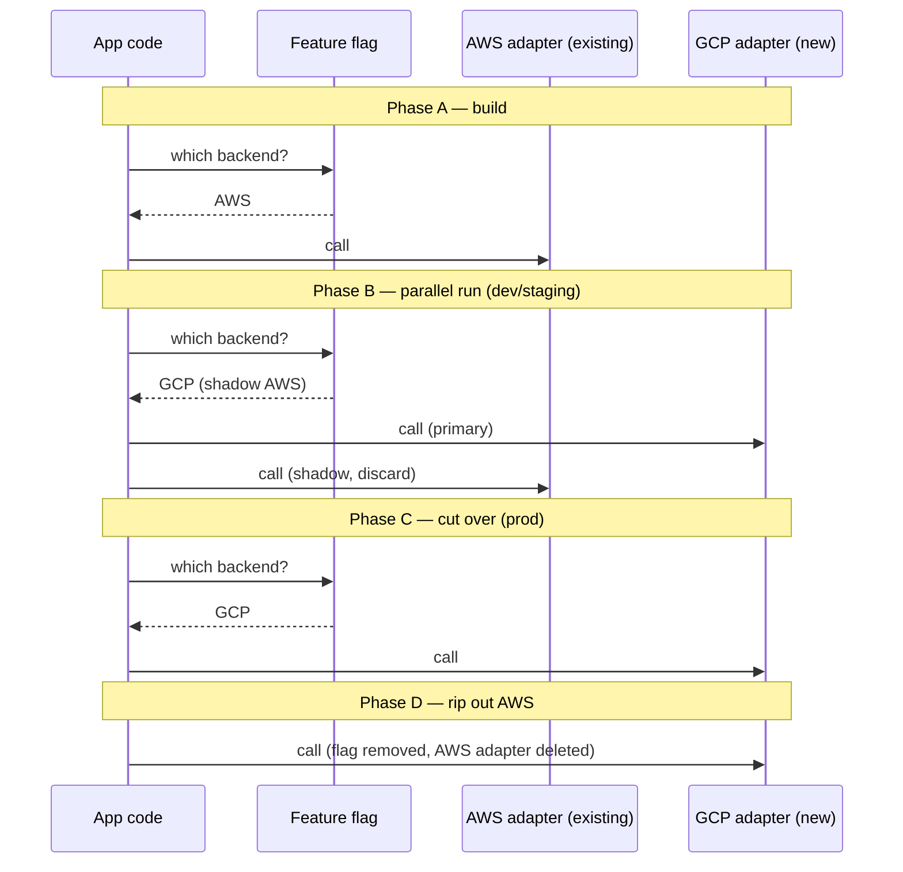

# ADR-007: Migration from AWS to Google Cloud Platform

## Status
Proposed

## Context

AI Studio is currently deployed on AWS: ECS Fargate (SSR), Aurora Serverless v2 (Postgres), Cognito (auth), Bedrock (Claude) alongside OpenAI/Azure/Google, S3 (uploads), Secrets Manager, CloudWatch (logs + metrics), SES (email), and a sizable CDK codebase under `/infra`. The codebase is the product of ~18 months of AWS-specific hardening — reusable CDK constructs (`ServiceRoleFactory`, `VPCProvider`), tag-based least-privilege IAM, Aurora auto-pause, ADOT tracing, Lambda right-sizing.

The decision to move to Google Cloud Platform (project `openclaw-gog-487717`) is already made at the organization level. A vertical slice is running locally today — Google SSO via NextAuth's Google provider, and streaming chat via Vertex AI / Gemini 1.5 Flash — documented in `docs/GCP_DEMO.md`. The slice was intentionally scoped to keep the diff small: AWS-flavored code remains in the repo as dead paths so the demo doesn't regress on `typecheck` and the team can reason about one workstream at a time.

This ADR defines the target GCP architecture and the migration strategy to reach it without interrupting AI Studio users.

### What's already in place (after the demo slice)

- `lib/ai/provider-factory.ts` includes a `google-vertex` provider alongside `openai`, `google`, `amazon-bedrock`, `azure`, `latimer`. Adapter pattern already works.
- Google SSO wired through NextAuth v5 (`auth.ts`). On first sign-in the user row is upserted by Google `sub` with email fallback.
- GCS upload adapter exists in `lib/aws/document-upload.ts`, feature-flag gated.
- Cloud Monitoring typed-values publisher in place; `CLOUDWATCH_METRICS_ENABLED=false` disables the AWS publish.
- Local dev uses Postgres in Docker (Issue #607), which mirrors Cloud SQL semantics far better than Aurora's RDS Data API ever did.

### What's still pure AWS

- `/infra/` is 100% AWS CDK — networking, compute, storage, secrets, monitoring, auth.
- Prod traffic still hits Cognito → ECS → Aurora.
- Bedrock is the real Claude path in prod.
- Logs and metrics still go to CloudWatch in prod.
- Mail still goes through SES.

## Decision

Migrate to GCP using a **strangler / parallel-run** pattern: for each AWS service, introduce a GCP adapter behind a feature flag, dual-run in lower environments until parity is verified, cut over one environment at a time, then **remove the AWS adapter** as the final task of each workstream.

Four shaping choices:

1. **Strategy: Strangler / parallel run.** No big-bang. Every workstream can be rolled back independently by flipping a flag.
2. **AWS code: scheduled rip-out per phase.** Dead AWS code does not live indefinitely. Each workstream has an explicit "remove AWS adapter" task; by the end of the migration `/infra/` and all `lib/aws/*` modules are gone.
3. **IaC: Terraform for GCP, retire AWS CDK.** New `/infra-gcp/` in Terraform. `/infra/` is retired stack-by-stack as each service's responsibility moves.
4. **Keep the app layer untouched where possible.** The AI SDK provider factory, auth provider factory, and storage adapter pattern are the right seams; we lean on them rather than rewriting business logic.

## Target Architecture

### AWS → GCP Service Mapping

| Layer | Today (AWS) | Target (GCP) | Notes |
|---|---|---|---|
| Identity | Cognito | Identity Platform + Google OIDC via NextAuth | Already working in demo; `sub`-keyed upsert handles account linking. |
| SSR / Web | ECS Fargate | Cloud Run (2nd gen) | Scale-to-zero in dev; min-instances=1 in prod. Same container image, ADC replaces task-role creds. |
| Async jobs | Lambda | Cloud Run Jobs | One-off + scheduled jobs; Cloud Scheduler replaces EventBridge rules. |
| Database | Aurora Serverless v2 | Cloud SQL for Postgres 16 | HA regional in prod; single-zone in dev. pgvector installed for embeddings. |
| Object storage | S3 | Cloud Storage (GCS) | Signed URLs via service account; lifecycle rules for archival. |
| Secrets | Secrets Manager | Secret Manager | Versioned secrets; IAM-bound to Cloud Run service account. |
| Logs | CloudWatch Logs | Cloud Logging | Structured JSON already emitted by `@/lib/logger` — sink swap only. |
| Metrics | CloudWatch Metrics | Cloud Monitoring | Publisher already typed-values ready. |
| Tracing | ADOT → X-Ray | OpenTelemetry → Cloud Trace | OTel collector on Cloud Run sidecar. |
| Email | SES | **Decision deferred** — SendGrid, Postmark, or SES retained cross-cloud. Small spike in Phase 5. |
| CDN / Edge | CloudFront | Cloud CDN | Behind Global External HTTPS LB. |
| Load balancer | ALB | Global External HTTPS LB | Maps to Cloud Run via Serverless NEG. |
| DNS | Route 53 | Cloud DNS | Zone import, not migration. |
| Container registry | ECR | Artifact Registry | New image push target in CI. |
| IaC | AWS CDK (TypeScript) | Terraform | `/infra-gcp/` greenfield. |
| AI: Claude | Bedrock | Vertex AI model garden (Anthropic via Vertex) | Falls back to Anthropic direct API if Vertex availability lags. |
| AI: Gemini | — | Vertex AI (live) | Already in demo. |
| AI: OpenAI / Azure | Direct | Direct | No change — cloud-agnostic. |

### Target-state diagram

### Strangler adapter pattern (already the precedent)

Every workstream follows the same four beats. `lib/ai/provider-factory.ts` is the canonical example — a `google-vertex` case sits beside `amazon-bedrock` behind one interface, selected by the database-backed model row.

Feature-flag surface (concrete):

| Workstream | Flag | Values |
|---|---|---|
| Auth | `AUTH_PROVIDER` | `cognito` \| `google` |
| AI | per-model `provider` column in `ai_models` table | `amazon-bedrock` \| `google-vertex` \| ... |
| Storage | `STORAGE_PROVIDER` | `s3` \| `gcs` |
| Secrets | `SECRETS_PROVIDER` | `aws-secrets-manager` \| `gcp-secret-manager` |
| Logs/Metrics | `CLOUDWATCH_METRICS_ENABLED`, `CLOUD_MONITORING_ENABLED` | `true` \| `false` (both can be true during dual-publish) |

Flags live in `@/lib/settings-manager` (database-first with env fallback), not in hardcoded config — same pattern we already use for AI provider keys.

## Phased Migration Plan

Eight phases. Every phase has an **exit criterion** (how we know we're done) and a **rollback** (how we back out). Phases 0–4 are parallel-safe; phase 5 is the first prod cutover point.

### Phase 0 — Foundation (2 weeks)

Goal: everything needed to deploy anything to GCP safely.

- GCP org / folder hygiene; `openclaw-gog-487717` confirmed as dev target; staging + prod projects created.
- Terraform bootstrap: remote state in GCS, state locking, per-env workspaces (dev/staging/prod).
- Networking: VPC per env, private service access for Cloud SQL, Serverless VPC Access for Cloud Run.
- IAM baseline: service accounts per workload, custom roles mirroring the least-privilege patterns we enforce in CDK today. Terraform module `sa-factory` is the spiritual replacement for `ServiceRoleFactory`.
- Artifact Registry repo; Docker image push from existing CI pipeline (parallel to ECR push).
- CI: GitHub Actions `deploy-gcp` workflow alongside existing AWS deploys.

**Exit criterion**: `terraform apply` in all three GCP projects produces a working VPC, Artifact Registry, and an empty Cloud Run service returning 200 from `/api/healthz`.

**Rollback**: delete the projects. No production impact.

**Rip-out**: none yet.

### Phase 1 — Auth (1 week to harden prod)

Status: demo-complete. What's left is staging + prod hardening.

- Google Workspace domain restrictions (if required by policy).
- Cognito-user → Google-sub migration strategy confirmed. First-sign-in upsert (already in code) handles the common case; any accounts with no matching Google identity get an admin-assisted path.
- Session cookie and NextAuth secret rotation on cutover.
- Remove Cognito env vars from `.env.example`, CI, and deployed secrets stores.

**Exit criterion**: `AUTH_PROVIDER=google` in all environments; no Cognito calls in last 7 days of logs.

**Rollback**: flip `AUTH_PROVIDER` back; Cognito user pool still exists until Phase 7.

**Rip-out**: delete NextAuth Cognito provider config, `lib/auth/cognito-*` modules, and Cognito CDK stack (stays until Phase 7 to ease rollback).

### Phase 2 — AI providers (1 week)

- Promote `google-vertex` from "demo option" to first-class provider in prod. Add Claude-on-Vertex entries to `ai_models` as the Bedrock replacements.
- Service account on Cloud Run gets `roles/aiplatform.user`.
- Validate parity: a small eval harness replays a fixed prompt set against Bedrock and Vertex-Claude, compares outputs for obvious regressions.
- Flip each `ai_models` row's `provider` from `amazon-bedrock` to `google-vertex` under a model-selector UI toggle for admins.

**Exit criterion**: zero Bedrock invocations in prod for 14 consecutive days.

**Rollback**: flip `provider` back on the affected `ai_models` row.

**Rip-out**: delete `createBedrockModel` and the `amazon-bedrock` case from `provider-factory.ts`; remove `@ai-sdk/amazon-bedrock` dependency; drop BedrockStack in CDK.

### Phase 3 — Storage (2 weeks)

- GCS buckets per env, with lifecycle + CMEK mirroring current S3 setup.
- Feature-flag the existing GCS adapter to primary in dev, shadow-write in staging, prod still S3.
- Data migration: Storage Transfer Service (S3 → GCS) for historical objects. New uploads dual-write during overlap.
- Signed URL path: Cloud Run's attached SA signs URLs (no key material in code).
- Nexus 500MB attachment ceiling confirmed on GCS (same as S3 limit today).

**Exit criterion**: `STORAGE_PROVIDER=gcs` in prod for 14 days; S3 bucket read traffic is zero.

**Rollback**: flip the flag; S3 still holds a copy of objects written during overlap.

**Rip-out**: delete `lib/aws/s3-*.ts`, remove `@aws-sdk/client-s3` dependency, drop StorageStack.

### Phase 4 — Database (3–4 weeks)

The highest-risk workstream. We split it.

- Stand up Cloud SQL for Postgres 16 with pgvector, HA, PITR, CMEK.
- Migrations runner: Cloud Run Job that runs the same migration SQL from `/infra/database/schema/*` against Cloud SQL. Adds filename to `migrationFiles` — no schema format change.
- Parallel connect: the app can connect to both Aurora and Cloud SQL via `DATABASE_URL_PRIMARY` / `DATABASE_URL_SHADOW`. Shadow reads validate row-count and hash parity on a small set of tables.
- Logical replication: `pglogical` or Datastream from Aurora → Cloud SQL keeps the replica within seconds of primary.
- Cutover: a planned maintenance window, 2–5 minutes. Aurora goes read-only → wait for replication lag to zero → flip `DATABASE_URL` → app restarts on Cloud SQL → open writes.
- pgvector parity: re-index embeddings post-cut (IVFFlat needs fresh ANALYZE).

**Exit criterion**: prod running on Cloud SQL for 14 days with no unplanned failover; embedding search p95 within 10% of Aurora baseline.

**Rollback**: replication direction reversed; flip `DATABASE_URL` back. Possible only within a narrow window after cut — beyond ~24 hours, rollback becomes a data-merge exercise, not a config flip. Plan assumes we tolerate this by freezing new features during the cutover week.

**Rip-out**: Aurora stack decommissioned at start of Phase 7 (not immediately — kept cold for a month as emergency restore).

### Phase 5 — Compute + Edge (2–3 weeks)

- Cloud Run service per env, image from Artifact Registry, Serverless VPC Access to Cloud SQL.
- Global External HTTPS LB with Serverless NEG → Cloud Run.
- Cloud CDN on the LB for static assets (same cache headers we set today on CloudFront).
- Cloud DNS zones; zone cut-over via low-TTL strategy: drop TTL to 60s a week before, flip A/AAAA records, raise TTL after.
- Blue/green at the Cloud Run revision level (100% → 0% traffic shift on failure) with the same health-check semantics as ECS (`/api/healthz` liveness, `/api/health` readiness — these endpoints already exist).

**Exit criterion**: `dev.aistudio...` → Cloud Run, then `staging.`, then `aistudio.` all resolving to GCP with TLS, latency within 10% of prior ALB+ECS baseline.

**Rollback**: DNS flip back to ALB (TTL is the only constraint). ECS keeps running through Phase 7.

**Rip-out**: FrontendStack-ECS, CloudFront, Route53 records, ECR repo.

### Phase 6 — Secrets + Observability (2 weeks, runs parallel to 3–5)

- Secret Manager: each AWS Secrets Manager secret recreated in Secret Manager with a **new value** (we take the opportunity to rotate). App reads via `google-cloud/secret-manager` SDK behind the existing `@/lib/settings-manager` cache.
- Cloud Logging: the structured JSON `@/lib/logger` already emits maps cleanly to Cloud Logging structured payloads. Log-based metrics recreate the custom CloudWatch metrics.
- Cloud Monitoring: dashboards built to match the existing "AIStudio-Consolidated-[Env]" CloudWatch dashboard — alerting policies recreated with equivalent thresholds.
- OpenTelemetry: the ADOT sidecar swaps to an OTel collector shipping to Cloud Trace. App instrumentation doesn't change.

**Exit criterion**: all critical alerts fire identically on both sides for 7 days; on-call drill against Cloud Monitoring passes.

**Rollback**: dual-publish stays on; CloudWatch stays the source of truth until drill passes.

**Rip-out**: remove `@/lib/metrics/cloudwatch-publisher.ts`, remove AWS SDK log transport, drop MonitoringStack.

### Phase 7 — Email decision + teardown (2 weeks)

- **Email spike first.** Choose between (a) SendGrid, (b) Postmark, (c) keep SES cross-cloud. Outcome: one more ADR. Current best guess: SendGrid, for GCP tenant-billing convenience, but the spike decides.
- AWS teardown checklist:
  - Cognito user pool → export user manifest for compliance, then delete.
  - Aurora → final snapshot, delete cluster (after 30-day cold period).
  - S3 → lifecycle transition to archive; delete buckets after 90-day retention.
  - CDK stacks → `cdk destroy --all` per env.
  - IAM roles, KMS keys, CloudWatch log groups.
  - AWS account → closed or retained as DR-only (org-level decision).
- Dependencies removed from `package.json`: `@aws-sdk/*`, `@ai-sdk/amazon-bedrock`, `aws-cdk-lib`, `aws-jwt-verify`.

**Exit criterion**: repo has zero `aws-` imports, no `/infra/` directory, no `AWS_` env vars, CI has no AWS secrets configured.

**Rollback**: not applicable — this phase only runs after a full 30-day stable period on GCP.

## Data Migration Details

Two databases of record, Postgres and user identity, dominate the risk.

**Postgres (Phase 4)**: Logical replication, one-way, Aurora → Cloud SQL. Tables filtered to the app schema — DMS/pglogical configs skip system tables. Replication slot monitored for lag. Cutover window uses a `SET default_transaction_read_only = on` on Aurora to drain in-flight writes.

**User identity (Phase 1)**: no bulk migration. On first post-cutover Google sign-in, the existing upsert-by-sub-with-email-fallback logic (already in demo) links the Google identity to the pre-existing user row. Users with no Google identity in our org (contractors, external collaborators) need admin-assigned access — this is the one manual step and it's tracked as a pre-cut audit.

**Secrets (Phase 6)**: values are **not** copied. Each secret is re-generated in Secret Manager with a fresh value, and the app is re-deployed with the new reference. This doubles as a scheduled rotation we've been deferring.

**Objects (Phase 3)**: Storage Transfer Service for historical S3 objects; app dual-writes during the overlap. Bucket-level ACLs don't carry over — GCS uses IAM, which is the cleaner model anyway; we translate S3 bucket policies to IAM bindings during bucket creation.

## Observability During Migration

Both clouds' dashboards stay live through Phase 6. On-call continues to page from CloudWatch until Phase 6 exit criterion passes. Cutover weeks for each phase get an explicit **error budget**: if error rate exceeds 1.1× the 30-day baseline for 30 minutes post-cut, we flip the flag back automatically (runbook included in the per-phase doc, not here).

## Consequences

### Positive

- **One cloud**, not two. Simpler mental model, simpler IAM, simpler billing.
- **Cloud Run scale-to-zero** in dev replicates what Aurora auto-pause does today but across the whole stack — expected dev cost reduction is meaningful.
- **Vertex model garden** consolidates Gemini + Claude under one auth chain (ADC + attached SA). No per-provider API keys in prod env.
- **Local-dev parity improves.** Postgres-in-Docker mirrors Cloud SQL closely; the RDS Data API quirks that motivated the Drizzle migration (Issue #603) go away entirely.
- **CI gets simpler**: one deploy target per env, not ECR+ECS+Amplify.
- **The adapter pattern we already use survives.** No business-logic rewrites. `lib/ai/provider-factory.ts` is the template.

### Negative / risks

- **Terraform learning curve.** CDK constructs like `ServiceRoleFactory` encode real safety invariants (tag-based cross-env access blocking). Terraform can match this, but it's work, and the first few weeks of Phase 0 carry "unknown unknowns" risk.
- **Two-cloud overlap cost.** Phases 3–5 run both stacks in parallel. Budget assumes 6–8 weeks of ~1.5× current spend.
- **Identity edge cases.** Users whose Cognito accounts don't match a Google identity need manual admin intervention. Expect a small long-tail of support tickets for 2 weeks post-Phase 1.
- **CloudWatch → Cloud Monitoring alert parity is not 1:1.** Some composite alarms don't translate cleanly. Phase 6 has a specific sub-task for each alarm that doesn't map.
- **Claude on Vertex availability.** Some model versions land on Bedrock earlier than Vertex. We tolerate this by allowing the `anthropic` direct-API provider as a fallback — kept even after AWS teardown, since it's not AWS-coupled.
- **Data residency.** If contracts require a specific region, Vertex and Cloud SQL placements need verification in Phase 0.
- **Skill concentration.** The current team's ops muscle memory is AWS-shaped. Pair rotations during Phases 4–6 are non-negotiable.

## Alternatives Considered

### Alt 1: Big-bang cutover per environment
Stand up full GCP, flip all traffic at once. **Rejected.** No incremental rollback; a single misconfigured service can take the whole env down. The strangler approach costs ~40% more wall-clock time but contains blast radius.

### Alt 2: Lift-and-shift to GKE, refactor later
Move ECS workloads to GKE near-as-is, then modernize into Cloud Run. **Rejected.** GKE's ops burden is higher than ECS's — we'd be adding complexity, not reducing it. Cloud Run is the better ECS-Fargate analogue for an SSR Next.js workload.

### Alt 3: Keep AWS adapters indefinitely as "fallback"
Leave Bedrock/S3/Cognito code in the tree forever. **Rejected.** Each adapter would need to keep passing CI, which means AWS SDK upgrades, secrets still provisioned, IAM still maintained. The perceived safety of "flip back to AWS" decays quickly and isn't worth the tax.

### Alt 4: Pulumi or CDKTF instead of Terraform
Keep TypeScript IaC ergonomics. **Considered, rejected.** Terraform's GCP provider coverage is deeper and matches the community-standard examples we'll lean on during Phase 0. Pulumi is a valid choice but small ecosystem for GCP-specific modules; CDKTF adds translation-layer debugging on top.

### Alt 5: Defer IaC choice — spike first
Make Phase 0 a bake-off between Terraform / Pulumi / CDKTF. **Rejected in favor of just picking Terraform.** Spike cost > expected decision value; if Terraform turns out to be wrong, we'll know early and pivoting one phase in is cheaper than delaying the whole plan.

## Success Metrics

| Metric | Target | Measurement |
|---|---|---|
| Unplanned downtime during any cutover | 0 minutes | PagerDuty + status page |
| p95 chat TTFB | ≤ current baseline + 10% | Cloud Monitoring custom metric |
| p95 embedding search latency | ≤ current baseline + 10% | Cloud Monitoring custom metric |
| Monthly infra cost, post-Phase 7 | ≤ current AWS bill | GCP Billing export |
| AWS adapter modules remaining in repo | 0 | `grep -r @aws-sdk lib/ infra/` returns empty |
| `typecheck` green throughout | 100% of commits | CI history |
| Bedrock invocations in last 7 days at end of Phase 2 | 0 | Provider-factory metrics |

## References

- `docs/GCP_DEMO.md` — the working vertical slice this ADR extends to production.
- `lib/ai/provider-factory.ts` — adapter-pattern precedent; the `google-vertex` case is the template every other workstream imitates.
- `auth.ts` — Google OIDC provider wiring + sub-keyed user upsert.
- `lib/aws/document-upload.ts` — flagged GCS adapter, a live example of the strangler pattern.
- `infra/lib/constructs/security/service-role-factory.ts` — tag-based least-privilege IAM pattern to replicate in Terraform during Phase 0.
- ADR-001 through ADR-006 — AWS-era architecture decisions; most are superseded phase-by-phase here but remain informative for understanding why the current shape is what it is.
- Related: Epic #372 (AWS Well-Architected optimization), Issue #603 (Drizzle migration), Issue #607 (local Postgres dev).

## Decision

Adopt strangler/parallel-run migration to GCP as described: Terraform in `/infra-gcp/`, AWS adapters scheduled for rip-out per phase, eight phases, first prod cutover at Phase 5 (compute+edge) or earlier for isolated services. The vertical slice in `docs/GCP_DEMO.md` is the working pattern; subsequent workstreams imitate it.

**Proposed by**: macsiah
**Date**: 2026-04-19
**Review date**: 2026-05-19
